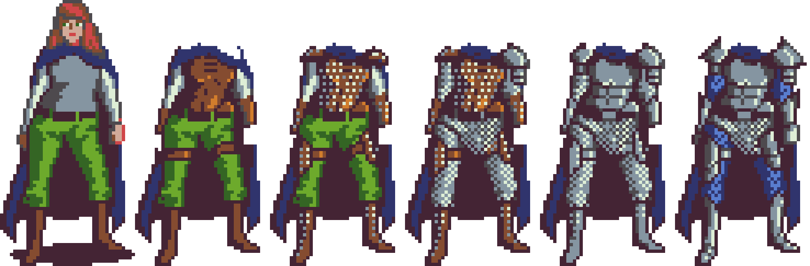

# Part 3: Sprite Sheets
{: .no_toc }

  

    Table of contents
  

  {: .text-delta }
1. TOC
{:toc}

## What is a Sprite Sheet?

A sprite sheet is a big picture made up of several smaller pictures. Imagine you
have a character in a video game, and you want that character to do different
things like walk, jump, and dance. Instead of having separate pictures for each
action, you put all of these pictures together on one big sheet. When you want
the character to do something, like walk, the game looks at that big sheet and
shows just the part with the walking picture. This makes it easier for the game
to show different actions quickly and smoothly without using too much computer
memory.

## Slicing a Sprite Sheet

The `heroine.png` file is a sprite sheet that contains the heroine we will use as well as several different armor options.

### Add the Sprite Sheet to the Scene

If you try to add the image in its current form, it will add the entire sprite sheet to your scene.

1. Drag the `heroine` sprite asset into your scene. 

This creates a **Game Object** in the `Hierarchy` of the scene. We don't actually want this **Game Object**

2. Delete the created game object in the hierarchy by right clicking on it and selecting `Delete`

<video autoplay loop muted style="max-width:700px">
  <source src="../imgs/03/01-adding-sprite-sheet.webm" type="video/webm">
</video>

### Sprite Mode

In a 2D Unity project the default setting is to treat images as a single sprite. To change this, you need to set the `Sprite Mode`.

1. Select the `heroine` asset in the project window
2. In the `Inspector` change the `SpriteMode` to `Multiple`
3. Click `Apply`

<video autoplay loop muted style="max-width:700px">
  <source src="../imgs/03/02-multiple-mode.webm" type="video/webm">
</video>

### Slicing with the Sprite Editor

Next, you need to define each sprite. This can be done using the `Sprite Editor`. There are several slicing options to choose from. The provided image has been set up to be sliced into 6 even columns.

1. Select the `heroine` asset in the project window
2. In the `Inspector` click the `Sprite Editor` button
  * This will open the `Sprite Editor` window
3. Select the `Slice` drop down menu
4. Change the `Type` to `Grid By Cell Count`
5. Set the number of columns to 6
6. Click `Apply`

<video autoplay loop muted style="max-width:700px">
  <source src="../imgs/03/03-slice-sprite.webm" type="video/webm">
</video>

**Not so Pro Tip:** Taking time to create easily sliceable assets will improve your workflow. If you're working on a team, be sure to communicate with your artists on how you plan to slice your sprites.

## Add the Heroine Sprite to the Scene

Now that you have several sliced sprites, you can select them individually for use.

1. Select the `heroine` asset in the project window
2. Click the expand arrow to see all of the sprites
3. Select the first sprite and drag it into your scene

<video autoplay loop muted style="max-width:700px">
  <source src="../imgs/03/04-adding-heroine.webm" type="video/webm">
</video>

## Challenge

With the knowledge you've gained, can you slice the `weapons` sprite sheet?

When you're done, you should be able to select 7 individual weapons from the sprite sheet.

<video autoplay loop muted style="max-width:700px">
  <source src="../imgs/03/05-challenge.webm" type="video/webm">
</video>

## What's Next?

