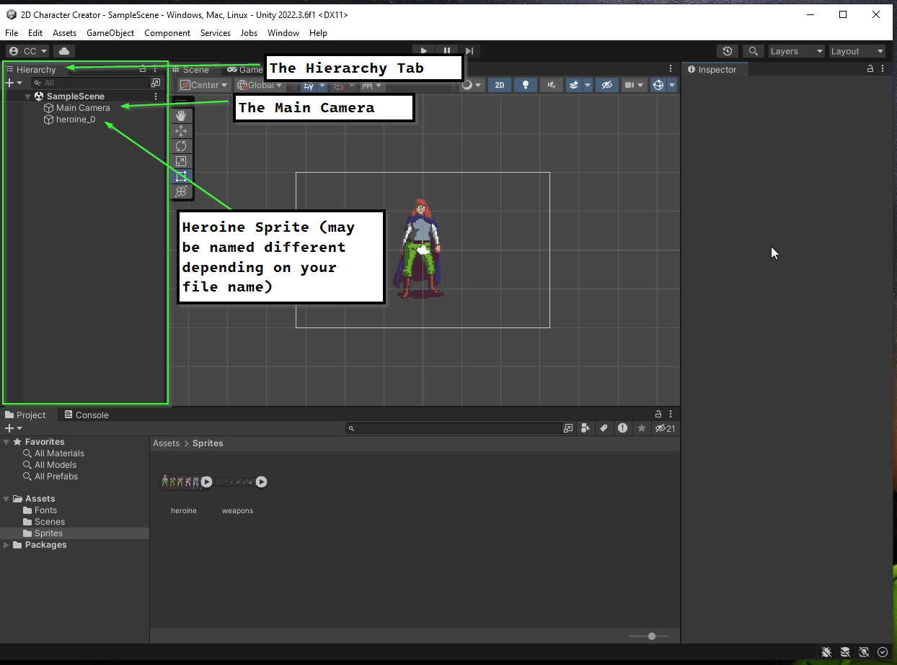
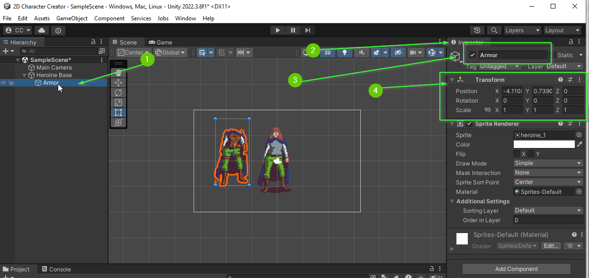
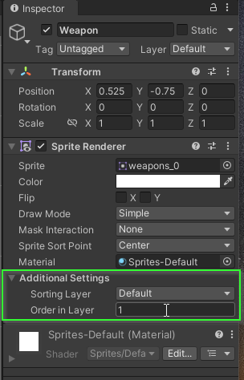
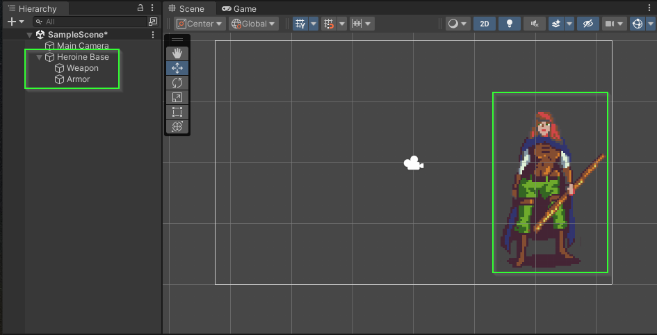

# Part 4: Scene Hierarchy
{: .no_toc }

In this section, you will explore how to add multiple GameObjects to the Scene
Hierarchy. Additionally, you will learn how to group GameObject to create a
**child**-**parent** relationship.

  

    Table of contents
  

  {: .text-delta }
1. TOC
{:toc}

## What is the Hierarchy?

In Unity, the hierarchy is a crucial component of the scene view that represents
the structure of objects within a scene. It functions as a parent-child
relationship system, where GameObjects can be organized hierarchically. This
hierarchy allows for the transformation and manipulation of objects in a
coordinated manner, making it essential for scene organization and interaction
in Unity game development.

## The Hierarchy Tab

In the `Default` view, the `Hierarchy` tab is on the left side of the Unity Editor interface. If you have followed instructions int he previous section, you should have two GameObjects in your Scene's Hierarchy: A `Main Camera` and an object representing the heroine sprite:

## What is a GameObject?

In Unity, a Game Object is a fundamental building block of a scene, representing
any element that can be placed in the game world. It acts as a container for
various components and functionalities. Game Objects can represent characters,
items, props, lights, cameras, and more, and they are crucial for creating
interactive and dynamic experiences in Unity game development.

## Renaming a GameObject

Every GameObject in a Scene has a name. To help stay organized, it is important
to try and name them appropriately. The Heroine sprite you added will be the base for the character in the scene. Rename the object `Heroine Base`.

To rename a GameObject:

1. Right Click on the GameObject in the Hierarchy
2. Select `Rename`
3. Enter the desired name
4. Press Enter

<video autoplay loop muted style="max-width:700px">
  <source src="../imgs/04/02-renaming-a-gameobject.webm" type="video/webm">
</video>

## Add an Armor GameObject

Next, add a new GameObject to represent the player's current armor.

1. Select a sprite from the armor set and drag it into the scene
2. Rename the GameObject `Armor`

<video autoplay loop muted style="max-width:700px">
  <source src="../imgs/04/03-add-armor-game-object.webm" type="video/webm">
</video>

## Child GameObjects

You may be finding it difficult to align your `Armor` GameObject with your
`Heroine Base`. The sprite is setup such that setting the positions to match
will align them. However, this is quite tedious to do (especially if your player
is not centered on the screen).

To make elements easier to manage, you can *nest* GameObjects within each other to group them together. To do this, you can drag a GameObject in the Hierarchy into another:

1. Select the `Armor` GameObject
2. In the Hierarchy, drag it into the `Heroine Base` GameObject

<video autoplay loop muted style="max-width:700px">
  <source src="../imgs/04/04-nest-game-object.webm" type="video/webm">
</video>

When we group one GameObject within another, we say that it is a child of that object. In this case, `Armor` is a **child** of `Heroine Base`. Similarly, `Heroine Base` is a **parent** of `Armor`.

## Aligning the Armor

To align the `Armor` GameObject, we need to adjust its **Transform** component.

### What is a Transform?

In Unity, a Transform is a component of a Game Object that defines its position,
rotation, and scale in the 3D or 2D world. It's a fundamental component for
spatial representation and manipulation of objects within a scene, allowing
developers to control their location, orientation, and size.

### Using the Inspector

In the default view, the `Inspector` tab is on the right side of the Unity
Editor interface. This tab displays information about GameObject or Asset that
is currently selected.

1. Click the `Armor` GameObject in the Hierarchy
2. Find the `Inspector` tab
3. Verify that the `Inspector` is showing the `Armor` GameObject
4. Locate the `Transform` component

### Updating the Transform

Because `Armor` is a child of `Heroine Base` its `Transform` component is *relative* to the `Heroine Base`. This means if we update the Position to be (0, 0, 0), it will be centered on the `Heroine Base`.

1. Update the `Armor` GameObject's `Transform`
   1. It should be at `X: 0, Y: 0, Z: 0`

<video autoplay loop muted style="max-width:700px">
  <source src="../imgs/04/06-align-armor.webm" type="video/webm">
</video>

### Move the Heroine Base

With the `Armor` centered on the `Heroine Base`, you can now freely position the `Heroine Base` and the `Armor` will follow. Adjust the location of your `Heroine Base` as you see fit.

1. Click the `Heroine Base``
2. Select the Move Tool
3. Drag the `Heroine Base` within the scene

<video autoplay loop muted style="max-width:700px">
  <source src="../imgs/04/07-move-heroine-base.webm" type="video/webm">
</video>

## Challenge: Add a Weapon

Using everything you learned, can you add a `Weapon` GameObject to the Scene?

1. Add your desired weapon to the scene
2. Rename the GameObject `Weapon`
3. Nest `Weapon` inside `Heroine Base` to make it a child
4. Adjust the `Weapon`'s transform to `X: 0.525` and `Y: -0.75`

**Bonus:** Your weapon may appear below the armor. You can fix this by adjusting
the `Order in Layer` property under `Additional Settings` on your `Weapon`.

If all went well, you should have a scene similar to the one below:

## What's Next?

In [Part 5: Sprite Renderer]() you will
learn how to use the Sprite Renderer component to swap out sprites on an
existing GameObject within your Scene.

