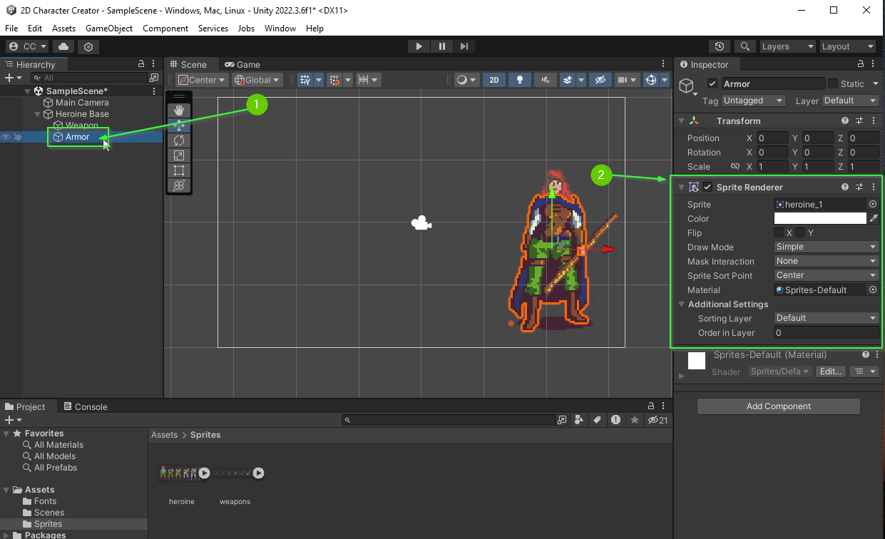
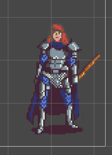
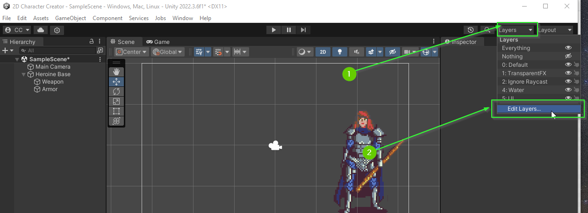
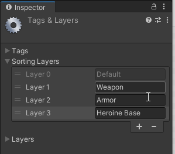
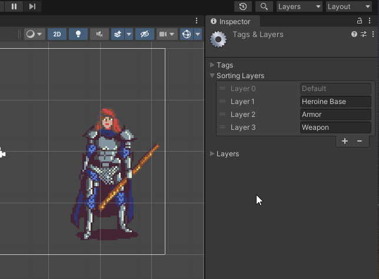

# Part 5: Sprite Renderer
{: .no_toc }

  

    Table of contents
  

  {: .text-delta }
1. TOC
{:toc}

## What is a Sprite Renderer?

A Sprite Renderer is a component in Unity used primarily for rendering 2D
graphics, such as images and sprites, within a scene. It allows you to display
2D textures or sprites in the game world, making it an essential part of
creating 2D games or incorporating 2D elements into a 3D game. By adjusting the
Sprite Renderer's properties, you can control aspects like sorting order, flip
sprites, and more to achieve the desired visual effects in your game.

## Sprite Renderer Properties

Find the `Sprite Renderer` component that is attached to your `Armor` GameObject.

1. Select the `Weapon` GameObject in the `Hierarchy``
2. In the `Inspector` tab, find the `Sprite Renderer` component

### Sprite Property

The `Sprite` allows you to change the sprite that is currently being displayed. There are multiple ways to do this. One option is to drag a new sprite into the inspector:

<video autoplay loop muted style="max-width:700px">
  <source src="../imgs/05/02-drag-to-change.webm" type="video/webm">
</video>

Another option is to click the small circle in the `Inspector` and select a sprite from the drop down menu:

<video autoplay loop muted style="max-width:700px">
  <source src="../imgs/05/03-drop-down-change.webm" type="video/webm">
</video>

**Note:** There are many more ways to modify this property. You will learn about
some of them later in this project.

### Color

The `Color` property allows you to add a color **Hue** to your sprites as well as changing the *alpha channel*. When the `Color` is set to be 100% white, there is no *Hue* applied:

<video autoplay loop muted style="max-width:700px">
  <source src="../imgs/05/04-color-change.webm" type="video/webm">
</video>

#### What is an Alpha Channel?

An Alpha Channel is a component of an image, typically a texture or a picture, that stores information about the transparency of each pixel. It defines how opaque or transparent each pixel should be, allowing for the precise rendering of objects with irregular or smooth edges, as well as enabling effects like soft edges and transparency in graphics and images.

### Flip

The Flip properties allow you to flip the sprite in the X and Y direction. This is useful for easily controlling a character that is moving left, right, up, or down on the screen:

<video autoplay loop muted style="max-width:700px">
  <source src="../imgs/05/05-flip.webm" type="video/webm">
</video>

### Draw Mode, Mask Interaction, Sprite Sort Point, Material

These properties can be useful for a variety of useful effects. However, we
won't be using them in this project. However, if you'd like to know more about
them I encourage you to read the friendly manual: [Unity
Manual](https://docs.unity3d.com/Manual/class-SpriteRenderer.html)

## Sorting Layer / Order in Layer

If you attempted to complete the **Bonus** from the last section, you likely
tried to adjust these settings. These settings allow you to specify the order in
which sprites that overlap are drawn to the screen.

For example, your `Weapon` GameObject might be drawn behind your `Armor`
GameObject:

### Order in Layer

By default, a Sprite Renderer is placed on the `Default` sorting layer. The `Order in Layer` then determines the order in which they are drawn. Lower numbers are drawn first and thus end up *BEHIND* those with higher numbers.

You can ensure the `Armor` is always drawn above the `Heroine Base` by setting it to be drawn *later* with a higher order. Similarly, you can ensure the `Weapon` is drawn above the `Armor` by setting its `Order in Layer` to be higher (later) than the `Armor`.

1. Set `Heroine Base` to have `Order in Layer: 0`
2. Set `Armor` to have `Order in Layer: 1`
3. Set `Weapon` to have `Order in Layer: 2`

<video autoplay loop muted style="max-width:700px">
  <source src="../imgs/05/07-order-in-layer.webm" type="video/webm">
</video>

### Sorting Layer

If you're thinking, "This is going to be hard to remember if I add even more
items". You're right! It will become increasingly difficult to manage. This is
where a **Sorting Layer** comes in handy.

A **Sorting Layer** allows you to define a **named** layer. This makes it much
easier to manage and remember as you add additional elements to your scene.

## Opening the Tags & Layers Settings

1. Click the `Layers` dropdown in the top right of the default layout
2. Select `Edit Layers`

This will open the projects `Tags & Layers` settings in the `Inspector` tab:

<video autoplay loop muted style="max-width:700px">
  <source src="../imgs/05/08-open-layers.webm" type="video/webm">
</video>

## Creating a Sorting Layer

1. Click the expansion arrow next to `Sorting Layers`
2. Click the `+` icon to create a new sorting layer
3. Modify the name of the new layer to `Weapon`

<video autoplay loop muted style="max-width:700px">
  <source src="../imgs/05/10-weapon-layer.webm" type="video/webm">
</video>  

### Challenge

Repeat the process above to create a layer for your `Heroine Base` and `Armor`.

When you're done, you should have 3 layers:

## Sprite Renderer Sorting Layer

With your Sorting Layers defined, you can now set the `Sorting Layer` property
on your `Sprite Renderer`s to the appropriate layer. Start with your `Heroine Base`.

1. Select the `Heroine Base` in the `Hierarchy`
2. Find the `Sprite Renderer` in the `Inspector`
3. Under `Additional Settings`
4. Set `Sorting Layer` to `Heroine Base`

<video autoplay loop muted style="max-width:700px">
  <source src="../imgs/05/12-heroine-base-layer.webm" type="video/webm">
</video> 

### Re-ordering Layers

In the video above, the `Heroine Base` sprite is now appearing on top
of the `Weapon` and `Armor` sprites! This is because the `Heroine Base` layer is "above" the `Default` layer. To fix this, we need to re-order the sorting layers.

1. Open the Layer Editor
2. If necessary, expand the `Sorting Layers`
3. Drag the `Heroine Base` layer such that it is above the `Default Layer`

<video autoplay loop muted style="max-width:700px">
  <source src="../imgs/05/13-re-order-layers.webm" type="video/webm">
</video> 

## Challenge

Using what you've learned, can you update the `Sorting Layer` for each of your
`Sprite Renderer`s? Don't forget to adjust the layer orders.

If all went well, you scene and layers should look similar to the image below:

## What's Next?

In [Part 6: Buttons]() you will learn how to use Unity's canvas system to display buttons on the screen.

