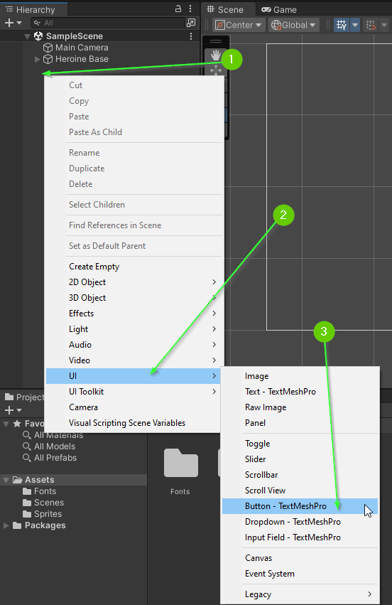
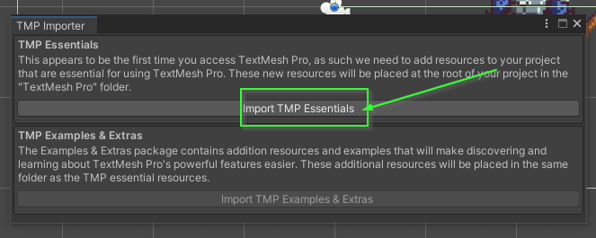
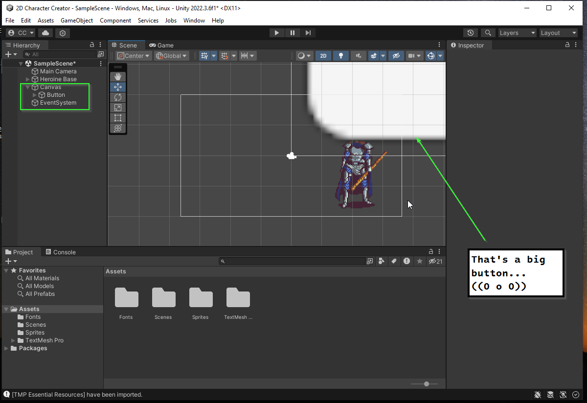
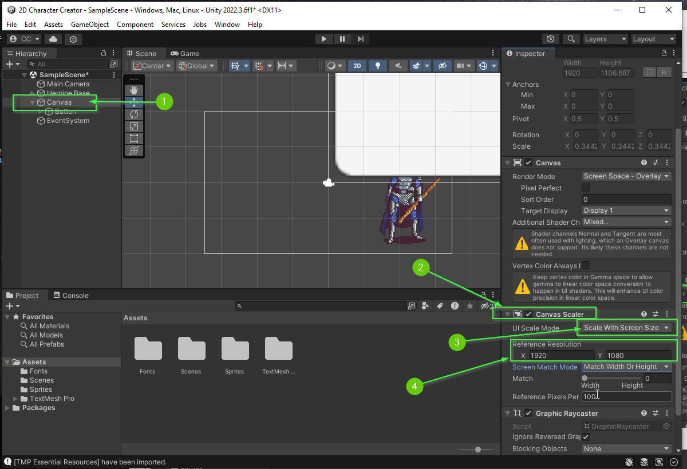
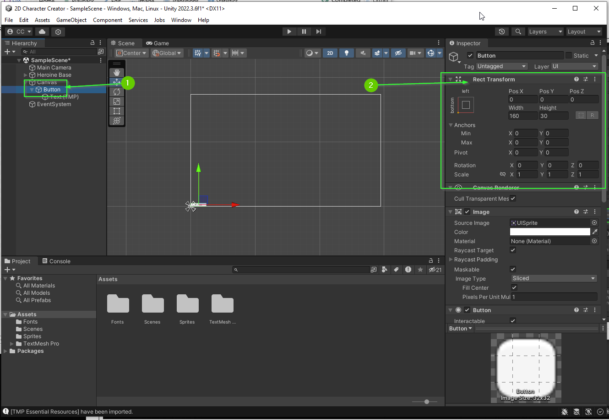
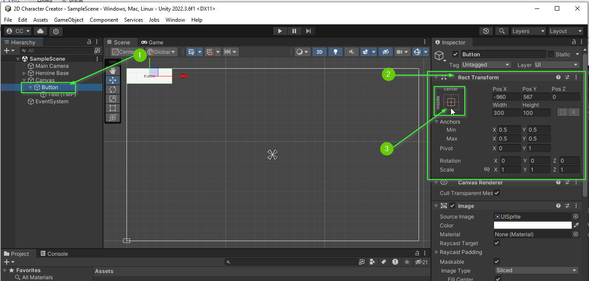
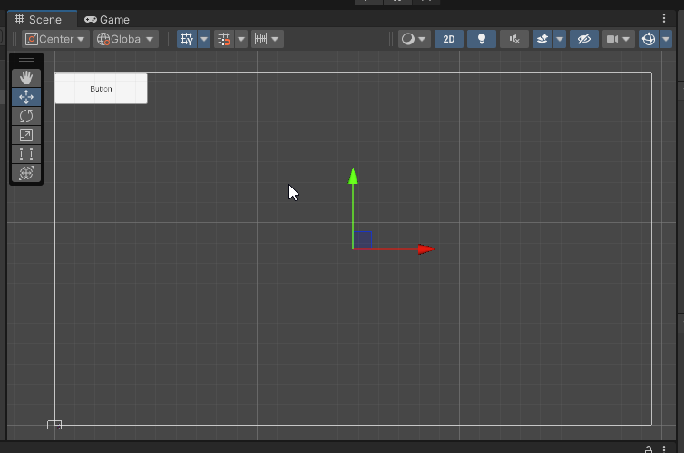
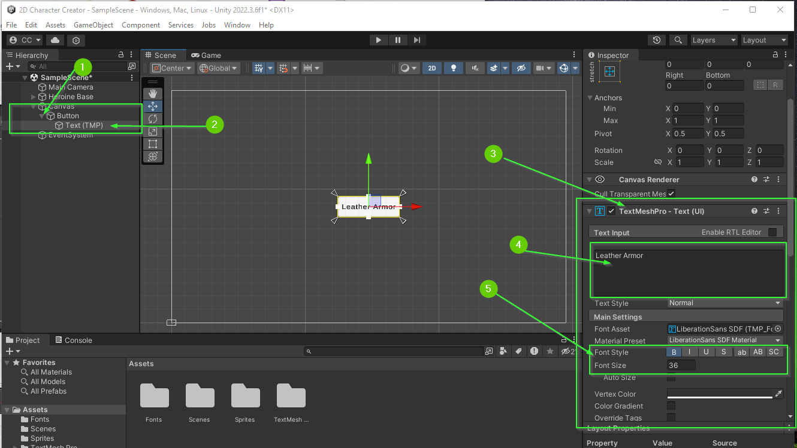
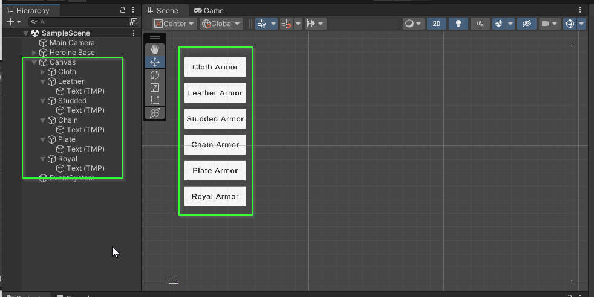

# Part 6: Buttons
{: .no_toc }

  

    Table of contents
  

  {: .text-delta }
1. TOC
{:toc}

## Adding a Button

To add a Button to your scene:

1. Right click in the Hierarchy
2. Select `UI` > `Button - TextMeshPro`

The first time you do this, a window will pop up asking you to `Import TMP Essentials`

3. Click the `Import TMP Essentials` button

After a moment, the dependencies should be added. You **do not** need to import the examples. You can close the pop up.

If all went well, you have a **MASSIVE** button in your scene. Additionally, you'll notice in the `Hierarchy` there are 3 new elements `Canvas`, `Button`, and `EventSystem`.

**Note: ** If you can't see the button, you may need to scroll out to see it (it should appear quite large).

## Canvas / Event System

A Button is a special type of `GameObject` that typically appears on top of
normal `GameObject`s and requires a special parent called a `Canvas`.
Additionally, because we typically want buttons to be clicked, Unity
automagically adds in an `EventSystem` which will allow us to interact with
buttons through clicking.

## Specifying a Model Resolution

The `Canvas` allows you to specify how the `UI` (user interface) should react to different
screen sizes. The size of a screen is typically referred to as a resolution and defines the size and density of a single pixel on a display. For our game, we will use what is typically called HD (High-Definition) which is a resolution of 1920x1080.

1. Select the `Canvas` from the `Hierarchy`
2. In the `Inspector` locate the `Canvas Scaler` component (you may need to scroll down)
3. Set the `UI Scale Mode` to `Scale With Screen Size`
4. Set the `Reference Resolution` to be `X: 1920` and `Y: 1080`

## Focusing in the Scene Tab

You are likely zoomed into the `Main Camera`'s current view which is not helpful for editing the `UI` for your players. You can manually zoom out but this is tedious. Instead, you can ask unity to focus on the `Canvas` in the `Scene` tab.

1. Select the `Canvas` in the `Hierarchy`
2. Press the `F` Key

This will focus the scene onto the selected game object. Alternatively, you can double click on the name in the hierarchy.

<video autoplay loop muted style="max-width:700px">
  <source src="../imgs/06/04-focus-canvas.webm" type="video/webm">
</video> 

If you'd like to go back to focusing on the `Main Camera` you can select it in
the `Hierarchy` and once again press `F` or double click on it. In fact, this
will work for any `GameObject` in the `Hierarchy`

<video autoplay loop muted style="max-width:700px">
  <source src="../imgs/06/05-focus-main-camera.webm" type="video/webm">
</video> 

## Button Properties

Your button is composed of two `GameObject`s the `Button` and a child component `Text (TMP)`.

1. Select the `Button` in your `Hierarchy`
2. Click the `Expand` icon to see the child component.

<video autoplay loop muted style="max-width:700px">
  <source src="../imgs/06/06-expand-button.webm" type="video/webm">
</video> 

The `Button` `GameObject` specifies the shape of the clickable object on the
screen and the `Text (TMP)` `GameObject` specifies how the text is displayed.

## Rect Transform

1. Select the `Button` in the `Hierarchy`
2. Find the `Rect Transform` component in the `Inspector`

The `Rect Transform` defines the size and location of a `UI` element. Take a moment to play with these values.

## Pivot and Relative Positioning

Because screen sizes can vary, it can be difficult to position elements perfectly on the screen. To help aid in positioning, we can specify the a `pivot` for which our position will be relative.

You can access the `pivot` menu by clicking the icon in the top right corner of the `Rect Transform` object.

1. Select the `Button` from the `Hierarchy`
2. In the `Inspector` find the `Rect Transform` component
3. Click the `pivot` icon

This will open a window that allows you to easily specify how the `Rect
Transform` should be placed relative to the parent container (in this case the
`Canvas`).

If you press the `Alt` and `Shift` keys this will also move the specified `GameObject` AND update the pivot on that `GameObject`.

* Hold the `Alt` and `Shift` keys try each of the 16 options to see how the pivot adjusts the button.

<video autoplay loop muted style="max-width:700px">
  <source src="../imgs/06/10-play-with-pivot.webm" type="video/webm">
</video> 

### Challenge: Place the Button in the Top Left Corner

Can you adjust your button's position to appear in the top left corner of the screen with a width of 300 and a height of 100?

When you're done, your scene should look similar to this:

## Changing Text

To change the text on a button:

1. Expand the `Button` in the `Hierarchy`
2. Select the child `Text (TMP)` component
3. In the `Inspector` find the `TextMeshPro` component
4. Change the text in the `Text Input` area
5. Adjust the `Font Size` and `Font Style` to your liking

## Challenge: Create Armor Buttons

There are 6 different armor options available.

Create 6 buttons, one for each armor option: Cloth, Leather, Studded, Chain, Plate, and Royal.

When you're finished, you should have a scene that looks similar to this:

## What's Next?

In [Part 7: On Click Event](), you will learn how to utilize Unity's event system
to trigger changes to the character's armor when a button is clicked.

