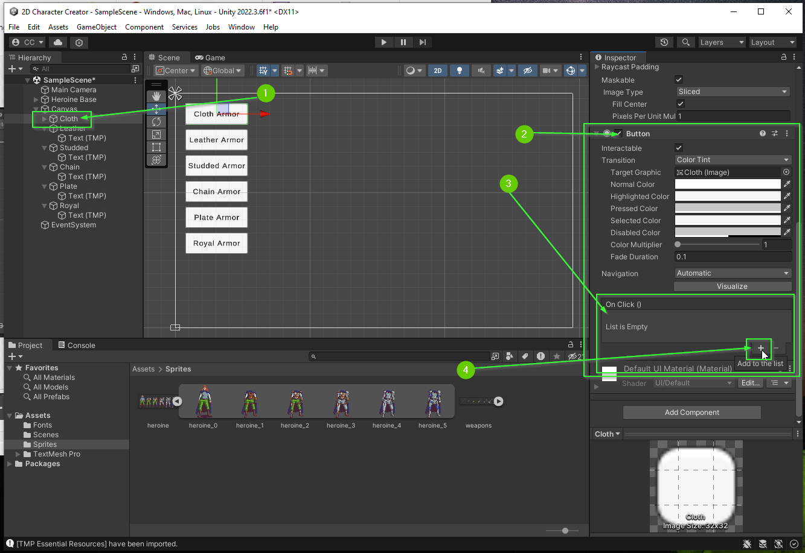
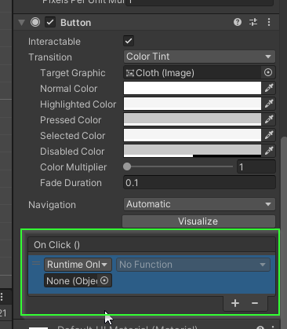
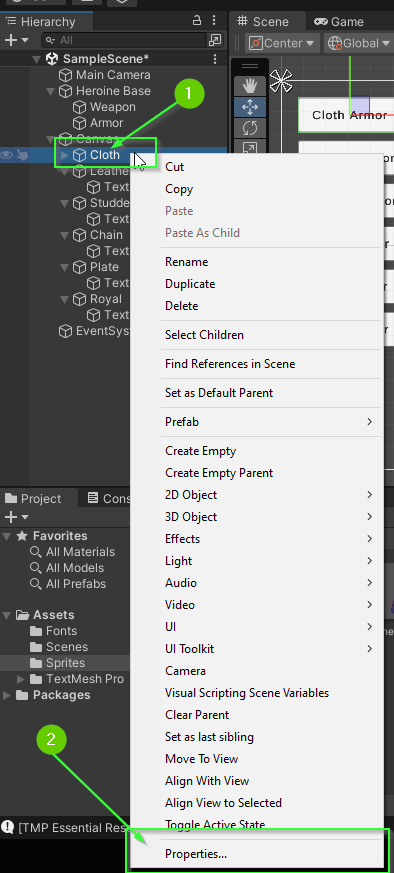
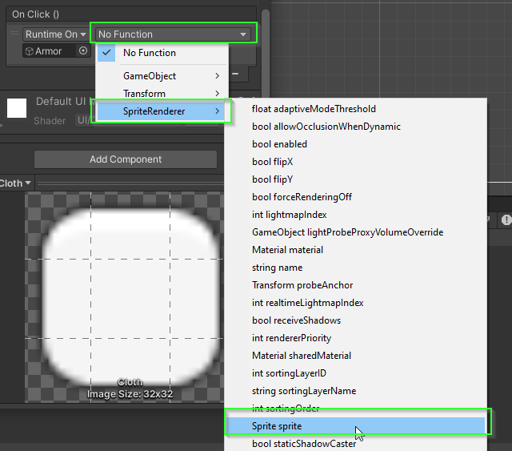

# Part 7: On Click Event
{: .no_toc }

  

    Table of contents
  

  {: .text-delta }
1. TOC
{:toc}

## The On Click Event

Unity's `UI` system uses an event system to allow your programs to react to user input. Each button component comes with an `On Click` event that can be accessed in the inspector.

1. Click on a button in your `Hierarchy`
2. Find the `Button` component in the `Inspector` (you may have to scroll down)
3. Find the `On Click` event
4. Click the `+` icon to add an **Event Listener** to the event

If all went well, you have a new **Event Listener** in your `On Click` event.

### What is an Event Listener?

In Unity, an event listener is a function or method that "listens" for a specific event to occur and then executes a block of code in response to that event. Events can be emitted by various types of game objects, components, or scripts, and the event listener acts as a subscriber to these events. For example, you might have a button in your game that, when clicked, fires an event to which other parts of your code are listening. When the button is clicked, the event listener catches this event and executes predefined actions, such as loading a new scene or updating a game score. This decouples the components of your application, making your code modular and easier to manage.

## Changing the Armor Sprite when Clicked

By default, the new **Event Listener** does nothing when the button is clicked. To make it do something interesting, you must attach it to a `GameObject` in your scene. In this case, you want
to modify the sprite on the `Armor` `GameObject`.

1. In the `Hierarchy` right click on the `Cloth` armor button.
2. Select `Properties` this will open a window that is inspecting that `GameObject`

**Note:** This is useful when you have to inspect more than one element at the
same time. It works on most `GameObject`s and `Assets` in a Unity project.

3. Select the `Armor` `GameObject` from the `Hierarchy`
4. Drag the `Armor` `GameObject` into the `GameObject` position on the **Event Listener** you made previously.

<video autoplay loop muted style="max-width:700px">
  <source src="../imgs/07/04-drag-armor.webm" type="video/webm">
</video> 

With the `Armor` object registered on the **Event Listener** you can now specify how to modify that `GameObject` when the button is clicked.

5. Click the `No Function` drop down
6. Select the `SpriteRenderer` from the menu
7. Select the `Sprite sprite` from the menu

Lastly, you must specify the new value for the `Sprite`.

8. Find the heroine sprite sheet in your assets
9. Expand the sprite sheet
10. Click an drag the cloth armor sprite into the empty sprite property in your **Event Listener**

<video autoplay loop muted style="max-width:700px">
  <source src="../imgs/07/06-set-sprite.webm" type="video/webm">
</video> 

## Testing the Button

Test the game: 

1. Click the `Play` icon in the top of the Unity Editor.
2. Wait a moment for Unity Play Mode to launch
3. Click the `Cloth Armor` button

**Note:** If all went well, your characters armor will change when you click the button.

4. Click the `Play` button again to exit Play Mode

**Warning:** Do not forget to exit Play Mode. If you make edits in play mode, the changes will not be saved.

<video autoplay loop muted style="max-width:700px">
  <source src="../imgs/07/07-test-it.webm" type="video/webm">
</video> 

## Challenge: Finish Armor Menu

Update each of your buttons to change the `Armor` sprite to the appropriate
armor selection.

When you're done, your program should function similar to the one in the preview below:

<video autoplay loop muted style="max-width:700px">
  <source src="../imgs/07/08-challenge-complete.webm" type="video/webm">
</video> 

## What's Next?

In [Part 8: Vertical Layout Group](), you will learn how to utilize Unity's Layout tools to help you manage the complexity of your user interfaces.

