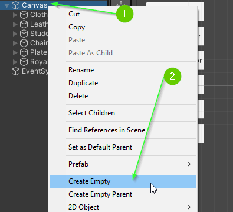
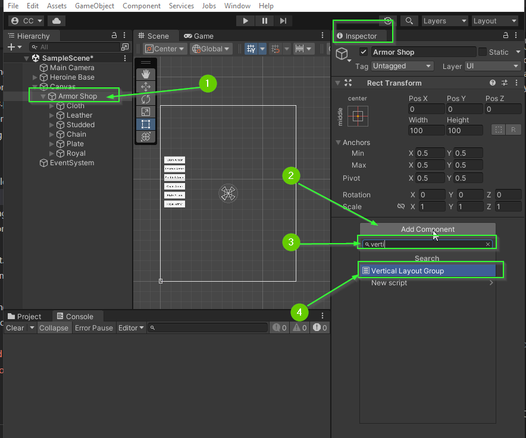

# Part 8: Vertical Layout Group
{: .no_toc }

  

    Table of contents
  

  {: .text-delta }
1. TOC
{:toc}

## Organizing Your UI Elements

Designing nice user interfaces and experiences is a huge challenge. You may have
found it incredibly annoying and difficult to adjust your buttons on the screen
to look nice. If this was the case, you're not alone! To help aid you in your UI
endeavors, Unity's Canvas provides a handful of layout managers. In this part,
you will use the **Vertical Layout** component to make it easier to display your
Armor buttons.

## Create a Container

Start by creating an empty Game Object in your Canvas to act as your armor
buttons.

1. Right click on your `Canvas` object in the `Hierarchy` Tab
2. Select `Create Empty`

This will create a new `GameObject` that is a child of your `Canvas`.

3. Rename the `GameObject` to be `Armor Shop`
4. Drag each of your Armor buttons within the `ArmorShop`

<video autoplay loop muted style="max-width:700px">
  <source src="../imgs/08/01-rename-and-reorganize.webm" type="video/webm">
</video>

## Add a Vertical Layout Component

Next, you will add a Vertical Layout component to the `Armor Shop` Game Object. The **Vertical Layout** component controls how children are organized.

1. Select your `Armor Shop` game object in the `Hierarchy`
2. In the `Inspector Tab` click the `Add Component` button
3. In the search box, begin typing `Vertical Layout Group`
4. Select `Vertical Layout Group`

After doing this, your buttons will likely shift to be within the `ArmorShop` component.

## Positioning the Armor Shop

By positioning and resizing the parent Game Object (`ArmorShop`) you can quickly and easily change the location of all the buttons within.

Play around with the pivot / position / size of your `ArmorShop` and observe how the children buttons reposition themselves.

<video autoplay loop muted style="max-width:700px">
  <source src="../imgs/08/03-play-with-position.webm" type="video/webm">
</video>

## Auto Sizing Children

The **Vertical Layout Group** has several settings that allow you to determine
how the child components should resize and be spaced based on the parents size.

* **Control Child Size**: This option will cause the parent to automatically resize the child components to fit within the parent container.

<video autoplay loop muted style="max-width:700px">
  <source src="../imgs/08/04-play-with-control-size.webm" type="video/webm">
</video>

* **Padding**: This option allows you to add space between the children and the parent container.

<video autoplay loop muted style="max-width:700px">
  <source src="../imgs/08/05-play-with-padding.webm" type="video/webm">
</video>

* **Spacing**: This option allows you to add space between each element. This works well if you are controlling the height of the children elements.

<video autoplay loop muted style="max-width:700px">
  <source src="../imgs/08/06-play-with-spacing.webm" type="video/webm">
</video>

* **Child Force Expand**: This option determines if the children should be expanded to take up the entire contents of the parent. This is usually on if you're controlling the height of the children.

<video autoplay loop muted style="max-width:700px">
  <source src="../imgs/08/07-play-with-force-expand.webm" type="video/webm">
</video>

There are several more options available that have different uses and purposes. For more details, you can read about them in the official Unity documentation: [LINK](https://docs.unity3d.com/Packages/com.unity.ugui@1.0/manual/script-VerticalLayoutGroup.html)

## Challenge: Play with Vertical Layout Group

Explore the **Vertical Layout Group** options and find settings that you like.

## Challenge: Create a Weapon Shop

Using everything you've learned so far, can you create a `Weapon Shop` menu?

* Create a Game Object container for your `Weapon Shop` that uses a **Vertical Layout Group**
* Add 7 Buttons to the Weapon Shop, one  for each weapon sprite

When you're done, your project will look and act similar to the video below:

<video autoplay loop muted style="max-width:700px">
  <source src="../imgs/08/08-challenge-complete.webm" type="video/webm">
</video>

## What's Next?

In [Part 9: Changing Shops](), you will learn how to enable and disable `GameObject`s in your scene to switch between your two shop menus.

