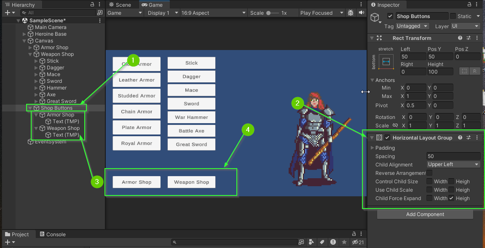
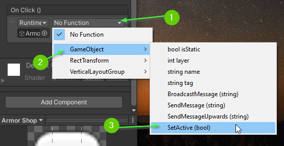
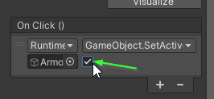

# Part 9: Changing Shops
{: .no_toc }

  

    Table of contents
  

  {: .text-delta }
1. TOC
{:toc}

## Challenge: Create a Shop Menu

Next, you will add a Shop Menu that contains 2 buttons. One for your Armor Shop
and one for your Weapon Shop.

1. Create a new empty `GameObject` within your `Canvas` called `Shop Buttons`
2. Add a `Horizontal Layout Group` component (Optional)
3. Add two new `Button`s to your `Shop Buttons` component
4. Place your `Shop Buttons` on your screen in a way that looks good to you

When you've finished, your scene should look similar to this:

## Enabling and Disabling a GameObject

`GameObject`s can be enabled and disabled in a scene through the `Inspector` tab.

1. Click your `Armor Shop` button in the `Hierarchy`
2. Locate the check box next to the buttons name in the `Inspector`
3. Check the box on and off.

Notice when you do, the `GameObject` name in the `Hierarchy` window will change
to a light gray color and the button disappears from the `Game` and `Scene`
tabs. When a `GameObject` is enabled it is said to be **active**. The video below
demonstrates the Armor and Weapon shop buttons being enabled and disabled.

<video autoplay loop muted style="max-width:700px">
  <source src="../imgs/09/01-disable-and-enable.webm" type="video/webm">
</video>

## Using the SetActive Method

You can enable and disable a `GameObject` using a button by using its
`SetActive` method. You will next modify the Armor Shop button to display
the armor buttons hide the weapon buttons.

First, disable the armor buttons and weapon buttons.

* Select the armor buttons parent GameObject in the `Hierarchy`
* In the `Inspector`, disable the buttons

<video autoplay loop muted style="max-width:700px">
  <source src="../imgs/09/02-disable-armor-shop.webm" type="video/webm">
</video>

* Repeat this process for your weapon buttons.

<video autoplay loop muted style="max-width:700px">
  <source src="../imgs/09/03-disable-weapon-shop.webm" type="video/webm">
</video>

* Select the `Armor Shop` button in the `Hierarchy`
* In the `Inspector` find the button component
* Add an `Event Listener` to the button's `OnClick Event`
  
<video autoplay loop muted style="max-width:700px">
  <source src="../imgs/09/04-add-event.webm" type="video/webm">
</video>

* Add the armor buttons parent GameObject to the Event Listener

<video autoplay loop muted style="max-width:700px">
  <source src="../imgs/09/05-add-armor-buttons.webm" type="video/webm">
</video>

1. Click the drop down to set the function to use when the button is clicked
2. Select `GameObject` > `SetActive (bool)`

* Click the check box below the `GameObject.SetActive` function. 
 
**Note:** If it is checked, it means that the registered `GameObject` will be set to active. If it is unchecked, it means that the registered `GameObject` will be set to be not active.

* Enter Play Mode and test your `Armor Shop` button

<video autoplay loop muted style="max-width:700px">
  <source src="../imgs/09/08-test-armor-shop.webm" type="video/webm">
</video>

## Challenge: Switching Between Shops

* Update the `Weapon Shop` button to activate the weapon buttons.

When you're finished, your scene should look similar to the one below:

<video autoplay loop muted style="max-width:700px">
  <source src="../imgs/09/09-challenge-completed.webm" type="video/webm">
</video>

## Challenge: Closing the Weapon / Armor Shops

You can add multiple **Event Listeners** to a single event which can allow a
single button to result in multiple actions.

* Update your `Armor Shop` button to also deactivate your weapon buttons when it is clicked
* Update your `Weapon Shop` button to also deactivate your armor buttons when it is clicked

When you're finished, your scene should look similar to the one below:

<video autoplay loop muted style="max-width:700px">
  <source src="../imgs/09/10-challenge-completed.webm" type="video/webm">
</video>

## What's Next?
In [Part 10: Adding Text](), you will learn how to add in text labels that will eventually display information about your selected items!

