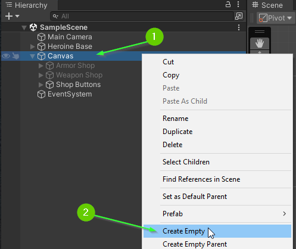
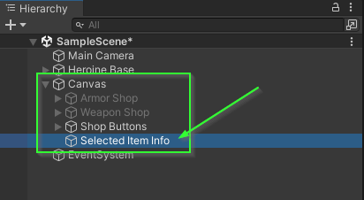
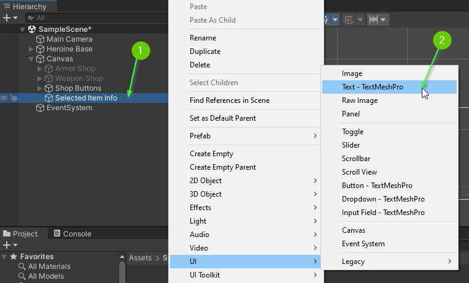
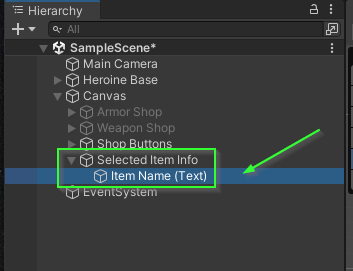
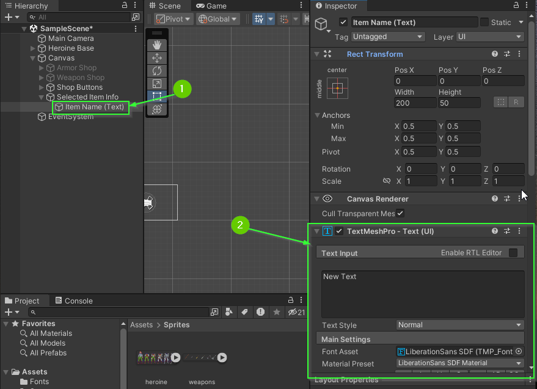
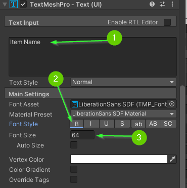
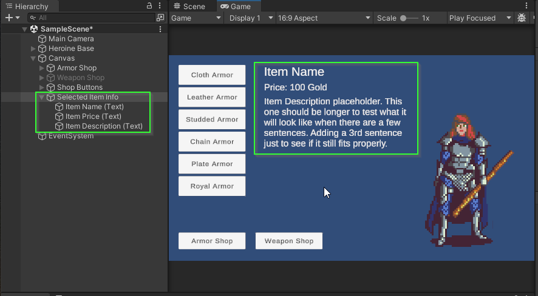

# Part 10: Adding Text
{: .no_toc }

  

    Table of contents
  

  {: .text-delta }
1. TOC
{:toc}

## Creating an Item Description Dialog

Each item that can be selected from your menus will have 3 properties:

1. A Name
2. A Price
3. A Description

## Create a Container for the Selected Item Info

To display this information, you can create a container to hold 3 `Text` `GameObjects`:

Within your `Canvas` element, add a new `GameObject` to be the container.

Rename the container to reflect that it will display information about the
selected item. In this guide, it will be referred to as `Selected Item Info`.

## Adding a Text GameObject to the Selected Item Info Container

1. Right click on the `Selected Item Info` container to create a child component
2. Select `UI` > `Text - TextMeshPro`

3. Rename the `GameObject` to reflect that this text will be the name of the item. In this guide, it will be referred to as `Item Name (Text)`.

## TextMeshPro - Text (UI) Component Properties

1. Select the `Item Name (Text)` `GameObject` in the `Hierarchy` tab
2. In the `Inspector` tab, find the `TextMeshPro - Text (UI)` component (you may have to scroll down)

The `TextMeshPro - Text (UI)` component provides properties you can modified to
change the way text is displayed on the screen. You may recall that your button
`GameObject`s each have one nested inside.

1. Change the displayed text to say be *Item Name*
2. Adjust the `Font Style` *Bold* by clicking the `B` in the `Main Settings`
3. Adjust the `Font Size` to be `64`

## Challenge: Add 2 More Text GameObjects

Remember that each item will have 3 properties: Name, Price, and Description

1. Add 2 more text game objects as children of the `Select Item Info` GameObject
   * One for `Item Price (Text)` 
   * Another for `Item Description (Text)`
2. Use a `Vertical Layout Group` to automagically size and place the labels in a
   way you find pleasing. 
   * **Optionally**: You may arrange them manually or using another layout manager of your choosing.
3. Adjust the styling of each of your text `GameObject`s to your liking.
4. If necessary, update the position of your armor and weapon buttons to fit nicely with your text.

When you're finished, your `Hierarchy` and `Game` view should look similar to this:

## What's Next?

<!-- In [Part 11: Changing Text](), you will update your buttons to modify the text  -->

