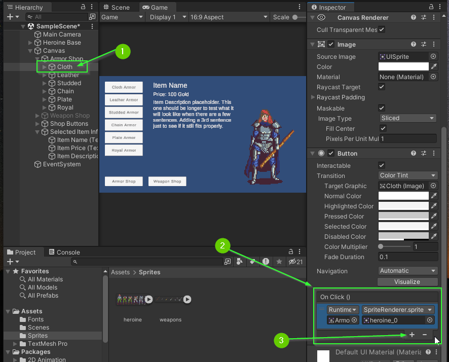
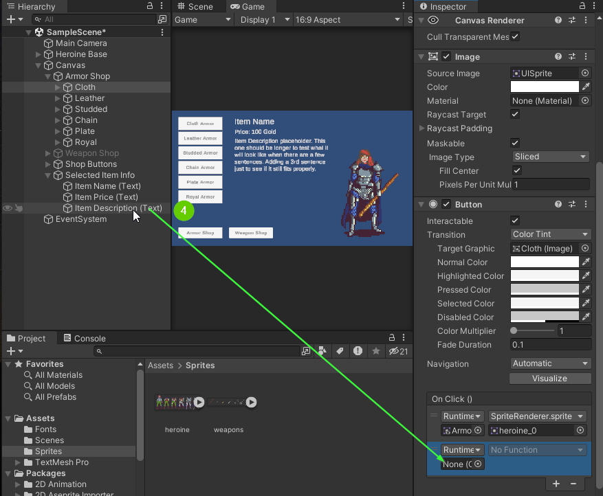
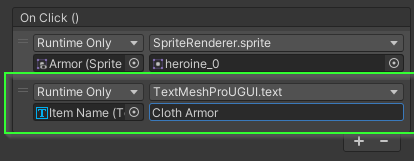

# Part 11: Changing Text
{: .no_toc }


<details open markdown="block">
  <summary>
    Table of contents
  </summary>
  {: .text-delta }
1. TOC
{:toc}
</details>

## Changing Text

The `TextMeshPro - Text (UI)` component allows you to modify the text property
while in Play Mode which means it can be changed using an Event Listener.

1. Select your cloth armor button in the `Hierarchy`
2. In the `Inspector`, find the `OnClick` event
3. Add a new Event Listener by clicking the `+` icon



4. Drag your `Item Name (Text)` `GameObject` into the new Event Listener



5. Click the Function Drop Down
6. Select `TextMeshProUGUI` > `string text`
   * You may need to scroll to find it as this component has many options

<video autoplay loop muted style="max-width:700px">
  <source src="../imgs/11/02-select-text.webm" type="video/webm">
</video>


7. Change the text property to be "Cloth Armor"
   * **Optionally**: You may choose a different name 



8. Test that the button works in Play Mode.

<video autoplay loop muted style="max-width:700px">
  <source src="../imgs/11/04-test-in-playmode.webm" type="video/webm">
</video>

## Challenge: Update Price and Description Text for Cloth Armor

1. Register 2 more Event Listeners on the cloth armor button.
2. The `Item Price (Text)` should update to: `Price: 5 Gold``
3. The `Item Description (Text)` should update to:


```
Light and breathable, this armor offers basic protection against minor threats.
Ideal for mages and archers who prioritize mobility.
```

When you've finished, you should have a scene that acts similar to this:

<video autoplay loop muted style="max-width:700px">
  <source src="../imgs/11/05-challenge-complete.webm" type="video/webm">
</video>

## Challenge: Hide Description Before Selection

You probably don't want your text to be visible to the player before they select
an item.

1. Disable the `Selected Item Info` container in the `Hierarchy`
2. Register another Event Listener on the cloth armor button.
3. When the button is clicked, Enable the `Selected Item Info` container

When you've finished, you should have a scene that acts similar to this:

<video autoplay loop muted style="max-width:700px">
  <source src="../imgs/11/06-hidden-text-challenge.webm" type="video/webm">
</video>

## Challenge: Add Names, Prices, and Descriptions to Each Button

Update all of your buttons to display the relevant information about the
selected item. When you're finished, your scene should act similar to the one
below:

<video autoplay loop muted style="max-width:700px">
  <source src="../imgs/11/07-add-all-items-challenge.webm" type="video/webm">
</video>

**Not So Pro Tip:** Test often! After each button, test that the button is working. Then save your work. 

**Warning:** Be careful not to edit while in Play Mode.


### Item Descriptions

If you would like, you may use the item names, prices, and descriptions found here.

**Cloth Armor**
Price: 10 Gold
Light and breathable, this armor offers basic protection against minor threats. Ideal for mages and archers who prioritize mobility.

**Leather Armor**
Price: 50 Gold
Made from toughened animal hide, leather armor provides decent protection without sacrificing too much agility. It's a favored choice among scouts and rogues.

**Studded Armor**
Price: 100 Gold
Leather armor reinforced with metal studs to give extra protection. A balance between weight and defense, perfect for adventurers on the move.

**Chain Armor**
Price: 150 Gold
Comprised of interlocking metal rings, this armor offers good defense against slashing attacks. It's flexible yet formidable, making it a popular choice for soldiers.

**Plate Armor**
Price: 250 Gold
Heavy and strong, plate armor offers the highest protection against physical attacks. Suitable for warriors who are at the frontline of battle.

**Royal Armor**
Price: 500 Gold
A majestic set adorned with gold and jewels, it provides not just defense but a status symbol. Worn by those of noble lineage or great honor.

**Stick**
Price: 1 Gold
A simple wooden stick, it can be used for basic self-defense or spellcasting. Often the first weapon of young mages or the resourceful traveler.

**Dagger**
Price: 40 Gold
Small and sharp, this blade is perfect for quick strikes and stealthy encounters. Favored by assassins and thieves.

**Mace**
Price: 120 Gold
A blunt weapon with a weighted end, the mace can crush armor and bones with ease. It's a favorite among clerics and paladins.

**Sword**
Price: 80 Gold
A versatile blade with a sharp edge, the sword is the staple weapon of many warriors. Its balance of reach and speed makes it suitable for various combat situations.

**War Hammer**
Price: 180 Gold
A heavy two-handed weapon, it can deal devastating blows, smashing through enemy defenses. Ideal for those looking to deliver crushing strikes.

**Battle Axe**
Price: 160 Gold
With a sharp blade on a sturdy handle, the battle axe is designed to cleave through foes. It's the choice of barbarians and fierce fighters.

**Great Sword**
Price: 220 Gold
A massive two-handed sword, its sheer size and weight can deal devastating damage. Wielded by the strongest of warriors, it's a symbol of power on the battlefield.

## What's Next?


